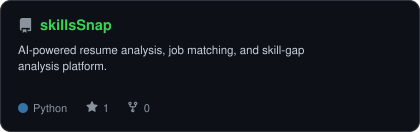
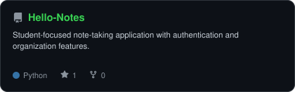

<div align="center">


# Krishna Kamal Baishnab

### Software Engineer · Backend Engineering · Systems & Problem Solving

I build backend systems, APIs, and software products with a focus on
**clean architecture, reliable data, and practical engineering.**

<br/>

<a href="https://github.com/krishnakamalbaishnab">
  
</a>
<a href="https://www.linkedin.com/in/krishnakamalbaishnab">
  
</a>
<a href="mailto:ht785618@gmail.com">
  
</a>
<a href="https://krishnakamalbaishnab.click">
  
</a>

</div>

---

## `~/whoami`

I'm a **Software Engineer focused on backend development**.

My primary interests are:

- Backend API development
- Java & Spring Boot
- Python backend development
- Database design
- System design
- Data structures & algorithms
- Docker and deployment
- Building practical software products

I enjoy understanding how systems work underneath the framework — from
database design and API boundaries to authentication, testing, deployment,
and production infrastructure.

---

## 🏗️ What I Build

<table>
<tr>
<td width="50%">

### Backend Systems

Designing and building REST APIs with:

- Java & Spring Boot
- Python & FastAPI / Flask
- PostgreSQL
- MongoDB
- Authentication & authorization
- Database migrations
- API integrations

</td>

<td width="50%">

### Engineering

I care about:

- Clean architecture
- SOLID principles
- Maintainable code
- Automated testing
- Containerization
- CI/CD
- Scalability
- Debugging real problems

</td>
</tr>
</table>

---

## 🛠️ Technology Stack

<div align="center">

### Languages


### Backend


### Databases


### Infrastructure & Tools


### AI & LLM Applications


</div>

---

## 📊 Engineering Radar

<div align="center">

<picture>
  <source media="(prefers-color-scheme: dark)" srcset="assets/radar-dark.svg">
  <source media="(prefers-color-scheme: light)" srcset="assets/radar-light.svg">
  
</picture>

</div>

> A self-assessment of the areas I currently focus on most.
> I'm continuously improving through projects, DSA practice,
> system design, and hands-on engineering.

---

## 🚀 Featured Projects

<div align="center">

<picture>
  <source media="(prefers-color-scheme: dark)" srcset="assets/card-skillsSnap-dark.svg">
  <source media="(prefers-color-scheme: light)" srcset="assets/card-skillsSnap-light.svg">
  
</picture>

&nbsp;&nbsp;

<picture>
  <source media="(prefers-color-scheme: dark)" srcset="assets/card-Hello-Notes-dark.svg">
  <source media="(prefers-color-scheme: light)" srcset="assets/card-Hello-Notes-light.svg">
  
</picture>

</div>

### 🎯 SkillSnap

AI-powered resume analysis and job matching platform focused on resume
analysis, skill-gap identification, job matching, and AI-assisted
recommendations.

**Built with:** Python · Flask · LLM APIs · Docker · REST APIs

[](https://github.com/krishnakamalbaishnab/skillsSnap)

---

### 📝 HelloNotes

A student-focused note-taking application built around authentication,
notes, folders, tasks, and academic organization.

**Built with:** Python · FastAPI · MongoDB · Bootstrap

[](https://github.com/krishnakamalbaishnab/Hello-Notes)

---

### 🏪 Retail Platform

A digital platform exploring how traditional pen-and-paper retail
workflows can be converted into a simple digital ordering experience
using QR-based access and WhatsApp-driven orders.

**Built with:** Java · Spring Boot · PostgreSQL · REST APIs

[](https://github.com/krishnakamalbaishnab/Retail)

---

### 🧒 Kids Platform

A larger full-stack application exploring authentication, role-based
portals, PostgreSQL data modeling, database migrations, Docker-based
development, and multiple application workflows.

**Built with:** Java · Spring Boot · PostgreSQL · React · Docker · Flyway

> Private project — currently under active development.

---

## ☁️ Backend & Infrastructure

My current backend development environment revolves around:

```text
Java / Spring Boot
        │
        ├── REST APIs
        ├── Authentication
        ├── PostgreSQL
        ├── Flyway
        └── Testing

Python
        │
        ├── FastAPI
        ├── Flask
        ├── AI / LLM integrations
        └── Data processing

Docker
        │
        ├── Local development
        ├── Multi-container applications
        └── Deployment workflows