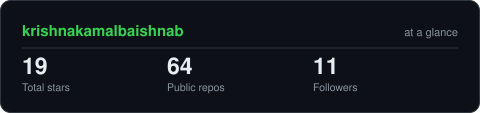

# Krishna Kamal Baishnab

### Software Engineer · Backend Engineering · Systems

I like taking an idea, turning it into a working system, and then figuring out how to make it reliable.

 

---

## 👋 A little about me

I'm a Software Engineer focused on backend development, with Java/Spring Boot and Python as my main tools.

I enjoy working close to the parts of a product that make everything else possible: APIs, databases, authentication, application architecture, testing, containers, and deployment.

I'm also interested in system design, data structures and algorithms, and practical applications of AI/LLMs.

---

## 🧰 What I work with

  

<table align="center">
<tr>
<td width="50%" align="left">

**Backend**

Java · Spring Boot · Python · FastAPI · Flask

</td>
<td width="50%" align="left">

**Data**

PostgreSQL · MongoDB · MySQL · Redis

</td>
</tr>
<tr>
<td width="50%" align="left">

**Infrastructure**

Docker · AWS · GCP · Linux · CI/CD

</td>
<td width="50%" align="left">

**Computer Science**

DSA · System Design · Databases · APIs

</td>
</tr>
</table>

---

## 📊 Engineering Radar

<picture>
  <source media="(prefers-color-scheme: dark)" srcset="assets/radar-dark.svg">
  <source media="(prefers-color-scheme: light)" srcset="assets/radar-light.svg">
  
</picture>

 

Self-rated areas I'm actively developing through projects, problem solving, and system-design practice.

---

## 🚀 Things I've built

<table align="center">
<tr>
<td width="50%" valign="top">

</td>
<td width="50%" valign="top">

</td>
</tr>
</table>

### 🏪 Retail

**A digital ordering platform for local retailers.**

Exploring QR-based access and WhatsApp-driven retail workflows.

**Java · Spring Boot · PostgreSQL · REST APIs**

[View repository →](https://github.com/krishnakamalbaishnab/Retail)

### 🧒 Kids Platform

**A full-stack marketplace and management platform.**

Exploring authentication, role-based portals, PostgreSQL data modeling, Flyway migrations, Docker-based development, and multiple application workflows.

**Java · Spring Boot · PostgreSQL · React · Docker · Flyway**

> Private project — currently under active development.

---

## ✍️ I write about what I learn

I keep technical notes and write about things I find useful while learning and building — from software engineering concepts to tools and experiments.

---

## 🧠 How I approach engineering

> **Build it. Break it. Understand it. Improve it.**

I prefer understanding a problem before reaching for a framework or workaround.

For me, good engineering is less about collecting technologies and more about knowing why a system behaves the way it does.

---

## 📈 GitHub

  

  

### Let's build something useful.

<a href="https://github.com/krishnakamalbaishnab">GitHub</a>
&nbsp;·&nbsp;
<a href="https://www.linkedin.com/in/krishnakamalbaishnab">LinkedIn</a>
&nbsp;·&nbsp;
<a href="https://krishnakamalbaishnab.medium.com">Writing</a>
&nbsp;·&nbsp;
<a href="mailto:ht785618@gmail.com">Email</a>

  

<i>Code is the implementation. Understanding is the skill.</i>

